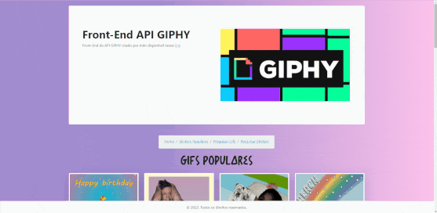
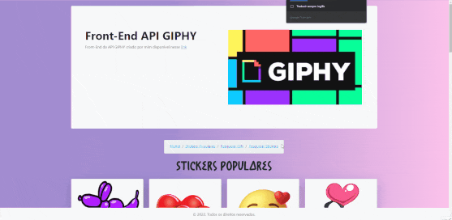

## API de consulta de gifs e stickers

Esta API tem como finalidade retornar um JSON gifs e stickers do site [giphy](https://developers.giphy.com/), com esse dados e possivel criar um sistema de pesquisa de gifs ou stickers ou mesmo exibir diretamente os gifs na tela de acordo com o que o usuario desejar, este projeto foi dividido em Back-End e Front-End.

## Instalação

Para rodar o projeto deve ter instalado o Node JS e o NPM e rodar os comandos abaixo:

```bash
  cd back-end
  npm install 
  npm run start
  -------------
  cd front-end
  npm install 
  npm run start
```

## Documentação da API

#### Rota de gifs populares

```
  GET /gifs/trending
```
*Sem parâmetros
#### Retorna um JSON

```
  Deve retornar um JSON com os dados dos gifs populares durante o dia atual, como no exemplo abaixo.
  {
    "data": [
        {
            "type": "gif",
            "id": "C3vlLhZAcgXBH2HYx3",
            "url": "https://giphy.com/gifs/IntoAction-lgbt-lgbtq-thankful-C3vlLhZAcgXBH2HYx3",
            "slug": "IntoAction-lgbt-lgbtq-thankful-C3vlLhZAcgXBH2HYx3",
            "bitly_gif_url": "https://gph.is/g/ZWegg97",
            "bitly_url": "https://gph.is/g/ZWegg97",
            "embed_url": "https://giphy.com/embed/C3vlLhZAcgXBH2HYx3",
            "username": "IntoAction",
            "source": "",
            "title": "Happy Mtv GIF by INTO ACTION",
            "rating": "g",
            "content_url": "",
            "source_tld": "",
            "source_post_url": "",
            "is_sticker": 0,
            "import_datetime": "2021-11-22 20:56:11",
            "trending_datetime": "0000-00-00 00:00:00",
            "images": { .......
````

#### Rota de stickers populares

```
  GET /stickers/trending
```
*Sem parâmetros

#### Retorna um JSON

```
  Deve retornar um JSON com os dados dos stickers populares durante o dia atual, como no exemplo abaixo
{
    "data": [
        {
            "type": "sticker",
            "id": "8hxrHsZpbQK3k2RW6m",
            "url": "https://giphy.com/stickers/cartoon-teddy-bears-teddytales-8hxrHsZpbQK3k2RW6m",
            "slug": "cartoon-teddy-bears-teddytales-8hxrHsZpbQK3k2RW6m",
            "bitly_gif_url": "https://gph.is/st/Y6a6boz",
            "bitly_url": "https://gph.is/st/Y6a6boz",
            "embed_url": "https://giphy.com/embed/8hxrHsZpbQK3k2RW6m",
            "username": "ukdesign422",
            "source": "",
            "title": "Tired Sweet Dreams Sticker",
            "rating": "g",
            "content_url": "",
            "source_tld": "",
            "source_post_url": "",
            "is_sticker": 1,
            "import_datetime": "2021-11-27 22:29:39",
            "trending_datetime": "0000-00-00 00:00:00",
            "images": { ........
````

#### Rota de pesquisa de gifs
```
  GET /gifs/search?q=${q}
```
| Parâmetro   | Tipo       | Descrição                                 |
| :---------- | :--------- | :---------------------------------------- |
| `q`         | `string`   | **Obrigatório**. String usada na pesquisa |

#### Retorna um JSON

```
  Deve retornar um JSON com os dados de pesquisa de gifs, como no exemplo abaixo
{
    "data": [
        {
            "type": "gif",
            "id": "9Dw95n3X406Ag",
            "url": "https://giphy.com/gifs/adorable-sweet-the-office-9Dw95n3X406Ag",
            "slug": "adorable-sweet-the-office-9Dw95n3X406Ag",
            "bitly_gif_url": "http://gph.is/1sFIAeB",
            "bitly_url": "http://gph.is/1sFIAeB",
            "embed_url": "https://giphy.com/embed/9Dw95n3X406Ag",
            "username": "",
            "source": "http://wifflegif.com",
            "title": "The Office Jim GIF",
            "rating": "g",
            "content_url": "",
            "source_tld": "wifflegif.com",
            "source_post_url": "http://wifflegif.com",
            "is_sticker": 0,
            "import_datetime": "2016-06-15 03:45:45",
            "trending_datetime": "1970-01-01 00:00:00",
            "images": { ........
````

#### Rota de pesquisa de stickers
```
  GET /stickers/search?q=${q}
```
| Parâmetro   | Tipo       | Descrição                                 |
| :---------- | :--------- | :---------------------------------------- |
| `q`         | `string`   | **Obrigatório**. String usada na pesquisa |

#### Retorna um JSON

```
  Deve retornar um JSON com os dados de pesquisa de stickers, como no exemplo abaixo
{
    "data": [
        {
            "type": "text",
            "id": "zL4zw4P8nXD1ZPCZrx",
            "url": "https://giphy.com/stickers/DanielaNachtigall-transparent-zL4zw4P8nXD1ZPCZrx",
            "slug": "DanielaNachtigall-transparent-zL4zw4P8nXD1ZPCZrx",
            "bitly_gif_url": "https://gph.is/st/EObxlOD",
            "bitly_url": "https://gph.is/st/EObxlOD",
            "embed_url": "https://giphy.com/embed/zL4zw4P8nXD1ZPCZrx",
            "username": "DanielaNachtigall",
            "source": "",
            "title": "Letter Q Sticker by Daniela Nachtigall",
            "rating": "g",
            "content_url": "",
            "source_tld": "",
            "source_post_url": "",
            "is_sticker": 1,
            "import_datetime": "2022-04-03 16:32:21",
            "trending_datetime": "0000-00-00 00:00:00",
            "images": { ........
````

## Telas do Front-End
Abaixo estão as telas implementadas no front-end com React JS para consumir a API:

#### Tela de Gifs populares


#### Tela de Stickers populares


#### Tela de pesquisa de Gifs


## Stack utilizada

**Back-end:** Node, Express, Axios, Cors <br/>
**Front-end:** React, React Bootstrap, Axios, React Spinners

## 🚀 Sobre mim
Eu sou uma pessoa desenvolvedora full-stack, usando as tecnologias Node JS no Back-end e React no Fron-end, API Restfull e estudando outras tecnologias interessantes e em alta no mercado.

## 🛠 Habilidades
Javascript, HTML, CSS, Node JS, PHP, Mongo DB, React...

## 🔗 Links
[](https://github.com/Diones25)
[](https://www.linkedin.com/in/diones-pereira-alves-31bb3969/)